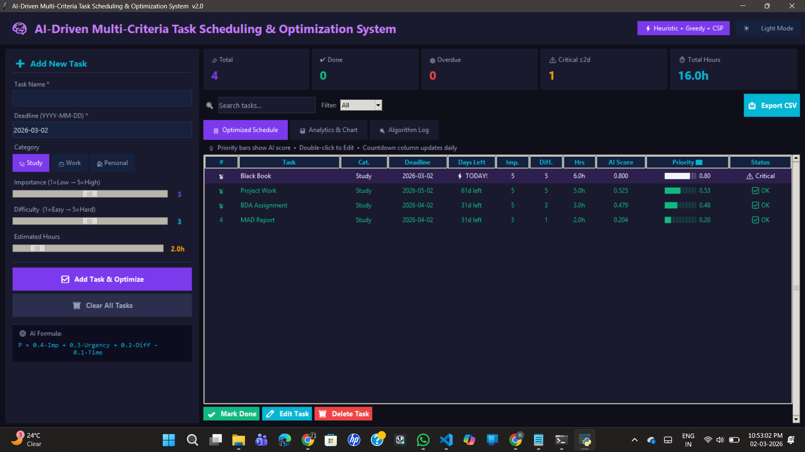
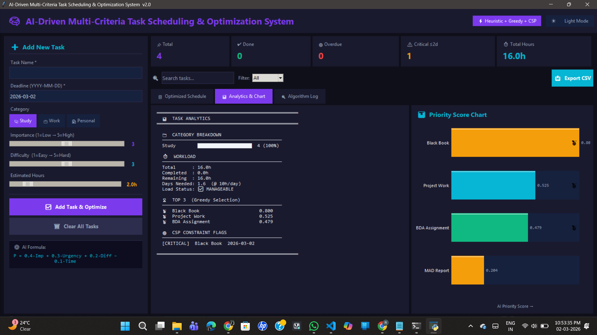

# 🧠 AI-Driven Multi-Criteria Task Scheduling & Optimization System

> **Developer:** Rutuja | [RutujaDeshmukh29](https://github.com/RutujaDeshmukh29) | 3rd Year AIML  
> **Tech Stack:** Python 3 + Tkinter (Zero external dependencies)  
> **Algorithms:** Heuristic Scoring · Greedy Optimization · Constraint Satisfaction (CSP)

---

## 📌 Project Overview

A desktop productivity application that uses **AI-based decision intelligence** to automatically rank and schedule tasks. Instead of manual to-do lists, the system computes an optimal priority score for each task using a weighted heuristic formula — mimicking how an intelligent agent would prioritize under multiple constraints.

This is not just a task manager. It is an **AI decision system** built on classical AIML algorithms.

---

## 🗂️ Directory Structure
```
AI_Task_Scheduler/
│
├── main.py              ← Complete application (single file)
├── tasks_data.json      ← Auto-generated data store (created on first run)
├── outputs/
│   ├── output.png       ← Example output screenshot
│   └── UI.png           ← Main UI screenshot
└── README.md            ← This file
```

---

## ⚙️ Algorithms Used

### 1️⃣ Heuristic Multi-Criteria Scoring
```
Priority Score  =  0.4 × Importance
               +  0.3 × Urgency
               +  0.2 × Difficulty
               −  0.1 × Estimated Time
```
All values are Min-Max normalized to [0, 1] before weighting.

### 2️⃣ Urgency Calculation (Exponential Decay)
```
Urgency = e^(−days_remaining / 7)
```
Tasks with closer deadlines receive an exponentially higher urgency score.

### 3️⃣ Greedy Optimization
Tasks are sorted in descending order of priority score.  
The greedy strategy always selects the highest-scored task next → produces a near-optimal execution schedule in **O(n log n)** time.

### 4️⃣ Constraint Satisfaction Problem (CSP)
| Flag       | Condition                          |
|------------|------------------------------------|
| 🔴 OVERDUE  | Deadline has already passed        |
| ⚠️ CRITICAL | ≤ 2 days remaining                 |
| ⚡ OVERLOAD | Estimated hours > 10h daily cap    |
| ✅ OK       | All constraints satisfied          |

---

## 🚀 How to Run

### Requirements
- Python 3.7 or higher
- Tkinter (comes built-in with Python — no pip install needed)

### Steps
```bash
# 1. Clone or download the project
git clone https://github.com/yourusername/AI_Task_Scheduler.git
cd AI_Task_Scheduler

# 2. Run directly
python main.py

# On some systems use:
python3 main.py
```

---

## ✅ Features — Quick Reference

| Feature | How to use |
|---|---|
| 🔍 Search & Filter | Type in search box or pick from dropdown |
| 📊 Priority bars | `████░░░░░ 0.72` visible in every row |
| ⏳ Countdown | "3d left" / "⚡ TODAY!" / "OVERDUE" column |
| ☀️ Theme toggle | Top-right button switches dark ↔ light |
| 🔔 Toast alerts | Slides in on every add/edit/delete/export |
| 📈 Canvas chart | Horizontal bar chart in Analytics tab |
| 🚨 Overload banner | Red bar appears if >30h pending work |
| ✏️ Edit dialog | Click row + Edit button OR double-click |
| 📤 Export CSV | Saves `schedule_YYYY-MM-DD.csv` next to file |
| 🎊 Confetti | 70 falling particles when task marked Done |

---

## 🖥️ UI Features

In addition to the quick reference, here are some core UI highlights:

| Feature | Description |
|---|---|
| 🎨 Dark Theme | Purple/Teal modern dark UI |
| 🌈 Pulse Animation | Header title colour cycles smoothly |
| 🕐 Live Clock | Real-time date and time display |
| 🏅 Medal Icons | 🥇🥈🥉 for top 3 priority tasks |
| 🟢 Flash Confirm | Green flash when task is added |
| 📋 3 Tabs | Schedule · Analytics · Algorithm Log |
| 🔴🟡✅ Colour Coding | Rows coloured by constraint status |
| 📊 Stat Cards | Live count of total/overdue/critical/hours |
| 💾 JSON Persistence | Data saved between sessions |

---

## 📸 Outputs

### Main User Interface


### Example Output


---

## 📊 How It Works — Step by Step
```
User Input
    ↓
Data Preprocessing     →  Normalize values, compute days remaining, urgency
    ↓
Heuristic Scoring      →  Compute weighted priority score for each task
    ↓
Constraint Check (CSP) →  Flag OVERDUE / CRITICAL / OVERLOAD tasks
    ↓
Greedy Optimization    →  Sort by score descending (best task first)
    ↓
Optimized Schedule     →  Display ranked task list + analytics + log
```

---

## 🧪 Example

| Task | Deadline | Importance | Difficulty | Hours | AI Score |
|---|---|---|---|---|---|
| ML Assignment | 2 days | 5 | 4 | 3h | **0.821** |
| Project Report | 5 days | 4 | 3 | 5h | 0.612 |
| Buy Groceries | 10 days | 2 | 1 | 1h | 0.234 |

→ System correctly ranks ML Assignment first due to high urgency + importance.

---

## 🔮 Future Extensions

- 🔁 **Reinforcement Learning** — adaptive weight tuning via Q-Learning
- 📅 **Google Calendar API** — sync deadlines automatically
- 📱 **Mobile App** — Flutter/React Native version
- 👥 **Team Mode** — multi-user task collaboration
- 📈 **Productivity Tracker** — completion rate over time

<div align="center">

**⭐ Star this repository if you find it helpful!**

Made with ❤️ by Rutuja

</div>
